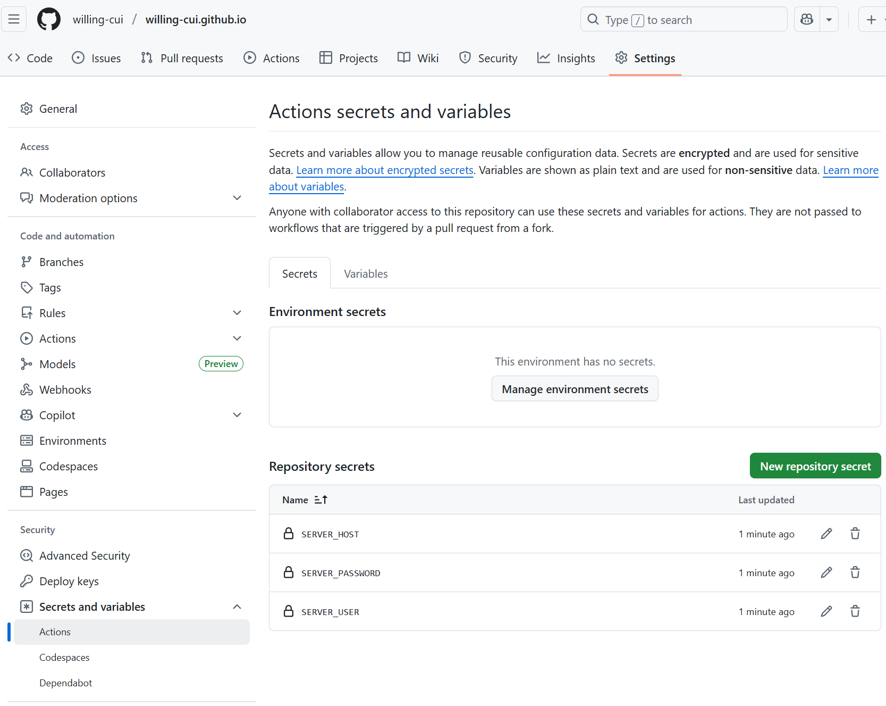

# Server Setup

## Initial Setup

**安装Web服务器软件**

以Ubuntu为例，安装Nginx的命令是：

`sudo apt update && sudo apt install nginx`

**上传静态网页文件**

将HTML、CSS、JavaScript和图片等静态文件，通过SFTP或SCP工具上传到服务器的Web根目录。

- 通常情况下，这个目录是 `/var/www/html`。 

也可以配置项目**使用 Github 自动部署**：

1. 在项目根目录创建 `.github/workflows/deploy.yml`文件。

2. 配置 GitHub Actions 工作流，示例：

   ```yaml
   name: Deploy to Server
   
   on:
     push:
       branches: [ main ]
   
   jobs:
     deploy:
       runs-on: ubuntu-latest
       steps:
         - uses: actions/checkout@v2
         - name: Copy files to server
           uses: appleboy/scp-action@master
           with:
             host: ${{ secrets.SERVER_HOST }}
             username: ${{ secrets.SERVER_USER }}
             password: ${{ secrets.SERVER_PASSWORD }}
             source: "."
             target: "/var/www/html"
   ```

3. 在 GitHub 仓库的 `Settings > Secrets`中添加服务器凭据（`SERVER_HOST`, `SERVER_USER`, `SERVER_PASSWORD`）。

   

​	关于 Github 配置的其他参考：https://zhuanlan.zhihu.com/p/433426848

4. 注意权限问题

   - **确认服务器用户和组**

     - **Web 服务器用户**：通常是 `www-data`（Apache/Nginx 默认用户，安装时已经创建该组）。

     - **代码推送用户**：代码推送用户，即 Github 设置中的 `SERVER_USER`, 需要被授予目录的读写权限。

   - **将 `ubuntu`用户加入 `www-data`组**

     为了让 `ubuntu`用户能够修改文件，同时让 Web 服务器读取文件，将 `ubuntu`加入 `www-data`组：

     ```bash
     sudo usermod -aG www-data ubuntu
     ```

     `-aG`：将用户追加（`-a`）到组（`-G`）中，不影响其他组。

   - **生效组权限**

     退出当前 SSH 会话并重新登录，或执行以下命令立即生效：

     ```bash
     newgrp www-data
     ```

   - **设置目录所有权和权限**

     **目录所有者设为 `ubuntu`，组设为 `www-data`**:

     ```bash
     sudo chown -R www-data:ubuntu /var/www/html
     ```

     允许 `ubuntu`用户通过组权限（`www-data`）写入文件：

     ```bash
     sudo chmod -R 775 /var/www/html
     ```

     `775`：所有者（`www-data`）和组（`www-data`）有读写执行权限，其他用户只有读和执行权限。

**配置和启动Nginx**

上传完成后，可以通过命令 `sudo systemctl start nginx` 来启动Nginx服务。 注意打开80端口。
